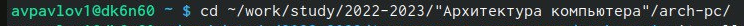

---
## Front matter
title: "Отчёт по лабораторной работе №3"
subtitle: Архитектура компьютера
author: "Павлов Арсений Валерьевич"

## Generic otions
lang: ru-RU
toc-title: "Содержание"

## Bibliography
bibliography: bib/cite.bib
csl: pandoc/csl/gost-r-7-0-5-2008-numeric.csl

## Pdf output format
toc: true # Table of contents
toc-depth: 2
lof: true # List of figures
lot: true # List of tables
fontsize: 12pt
linestretch: 1.5
papersize: a4
documentclass: scrreprt
## I18n polyglossia
polyglossia-lang:
  name: russian
  options:
	- spelling=modern
	- babelshorthands=true
polyglossia-otherlangs:
  name: english
## I18n babel
babel-lang: russian
babel-otherlangs: english
## Fonts
mainfont: PT Serif
romanfont: PT Serif
sansfont: PT Sans
monofont: PT Mono
mainfontoptions: Ligatures=TeX
romanfontoptions: Ligatures=TeX
sansfontoptions: Ligatures=TeX,Scale=MatchLowercase
monofontoptions: Scale=MatchLowercase,Scale=0.9
## Biblatex
biblatex: true
biblio-style: "gost-numeric"
biblatexoptions:
  - parentracker=true
  - backend=biber
  - hyperref=auto
  - language=auto
  - autolang=other*
  - citestyle=gost-numeric
## Pandoc-crossref LaTeX customization
figureTitle: "Рис."
tableTitle: "Таблица"
listingTitle: "Листинг"
lofTitle: "Список иллюстраций"
lotTitle: "Список таблиц"
lolTitle: "Листинги"
## Misc options
indent: true
header-includes:
  - \usepackage{indentfirst}
  - \usepackage{float} # keep figures where there are in the text
  - \floatplacement{figure}{H} # keep figures where there are in the text
---

# Цель работы
Целью работы является освоение процедуры оформления отчетов с помощью
легковесного языка разметки Markdown.
# Задание
1. В соответствующем каталоге сделайте отчёт по лабораторной работе №3
в формате Markdown. В качестве отчёта необходимо предоставить отчёты
в 3 форматах: pdf, docx и md.
2. Загрузите файлы на github.
# Выполнение лабораторной работы
1. Откроем терминал и перейдём в каталог курса сформированный при выполнении
лабораторной работы №2. (рис. [-@fig:001])
{fig:001 width=70%}

2. [Обновим локальный репозиторий, скачав изменения из удаленного
репозитория с помощью команды] (image/2.png){fig:001 width=70%}
3. [Перейдём в каталог с шаблоном отчета по лабораторной работе №3] (image/3.png){fig:001 width=70%}
4. [Проведем компиляцию шаблона с использованием Makefile. Для
этого введем команду make] (image/4.png){fig:001 width=70%}
5. [При успешной компиляции должны сгенерироваться файлы
report.pdf и report.docx. Откроем и проверим корректность
полученных файлов] (image/5.png){fig:001 width=70%} (image/6.png){fig:001 width=70%} (image/7.png){fig:001 width=70%}
6. [Удалим полученный файлы с использованием Makefile.Для этого
введем команду make clean] (image/8.png){fig:001 width=70%}
7. [Откроем файл report.md c помощью любого текстового редактора,
например gedit, изучим структуру этого файла и отредактируем его] (image/9.png){fig:001 width=70%}
8. [Загрузим файлы на Github] (image/10.png){fig:001 width=70%}
# Выводы
После проделанной работы мы освоили процедуры оформления отчетов с помощью легковесного языка разметки Markdown.
# Список литературы
https://esystem.rudn.ru/pluginfile.php/1639487/mod_resource/content/1/%D0%9B%D0%B0%D0%B1%D0%BE%D1%80%D0%B0%D1%82%D0%BE%D1%80%D0%BD%D0%B0%D1%8F%20%D1%80%D0%B0%D0%B1%D0%BE%D1%82%D0%B0%20%E2%84%963.pdf

::: {#refs}
:::
